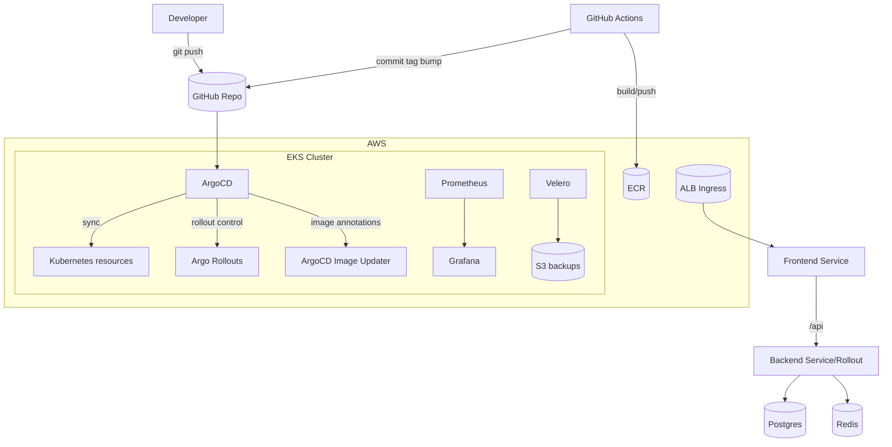

# Fullstack Microservices (Kubernetes • EKS • GitOps)

A portfolio-style, production-shaped platform that demonstrates:

- local learning deployment on **Minikube** (`k8s/`)
- EKS-ready hardened manifests (`eks/`)
- **Terraform** IaC (`terraform/`)
- **ArgoCD GitOps** source of truth (`k8s-manifests/` + `argocd/`)

## Architecture (high level)



## Repo map

- `backend/` – Node.js API
- `frontend/` – React + Nginx
- `k8s/` – local learning manifests (ingress-nginx, TLS, HPA, jobs, netpol, pdb, priority)
- `eks/` – EKS learning pack (ALB controller, monitoring, Karpenter, IRSA, hardened app YAML)
- `terraform/` – IaC scaffolding (VPC/EKS/ECR/IRSA modules)
- `k8s-manifests/` – GitOps Kustomize base/overlays (what ArgoCD syncs)
- `argocd/` – ArgoCD Applications (single app + App-of-Apps)

## Phase 3 quickstart (high level)

1) Provision infra with Terraform (learning scaffold)

- See `terraform/README.md` and `terraform/environments/prod/README.md`.

2) Install ArgoCD

- See `argocd/README.md`.

3) Sync GitOps manifests

- Simple mode: `argocd/applications/production.yaml`
- App-of-Apps mode: `argocd/applications/root-production.yaml`

> You must edit `repoURL` placeholders before applying.

## Validate GitOps manifests locally

This repo includes a validator that checks YAML parse and attempts to render overlays via `kubectl kustomize` or `kustomize build`.

```bash
python3 -m venv .venv
. .venv/bin/activate
pip install -r requirements-dev.txt
python hack/validate_gitops.py --overlay k8s-manifests/overlays/prod
```

## What’s next (remaining 20% → 100%)

See `PHASE3-GITOPS-TERRAFORM-ARGOCD.md` and the ongoing roadmap:

- ArgoCD Image Updater
- Progressive Delivery (Argo Rollouts)
- Sealed Secrets
- CI/CD (GitHub Actions → GitOps)
- Advanced monitoring dashboards/alerts
- Backup/DR (Velero)
- Architecture docs and diagrams

## Feature checklist (portfolio)

- [x] GitOps with ArgoCD (single app + app-of-apps)
- [x] Kustomize base/overlays (`k8s-manifests/`)
- [x] Progressive delivery (Argo Rollouts canary example)
- [x] Image automation (ArgoCD Image Updater annotations)
- [x] Encrypted secrets in Git (Sealed Secrets example)
- [x] CI/CD pipeline (GitHub Actions → ECR → Git tag bump)
- [x] Observability (Prometheus/Grafana values + alerts + dashboard JSON)
- [x] Backup/DR runbook (Velero docs + schedules)

## Presentation layer (screenshots)

If you want this repo to *feel* like a production portfolio project, add screenshots from:

- ArgoCD apps + sync history
- Argo Rollouts canary steps
- GitHub Actions run
- Grafana dashboard
- Velero backup/restore

Use the checklist here:

- `docs/screenshots/README.md`

### Docs

### Project timeline (10 phases)

If you want the full story from “first Docker build” → “production-grade GitOps platform”, read:

- `docs/phase-doc/README.md`

Each phase includes: what/why/how/tools/challenges/solutions/outcomes.

- CI/CD: `docs/cicd/github-actions.md`
- Sealed Secrets: `docs/security/sealed-secrets.md`
- Backup/DR: `docs/ops/backup-dr.md`
- Architecture deep dive: `docs/architecture.md`
- Demo walkthrough: `docs/demo.md`

### Troubleshooting

- If `npm install` fails in `backend/` with `EACCES`, check ownership of `backend/node_modules`.
	In this workspace it was owned by `root`, which prevents installs as a normal user.
