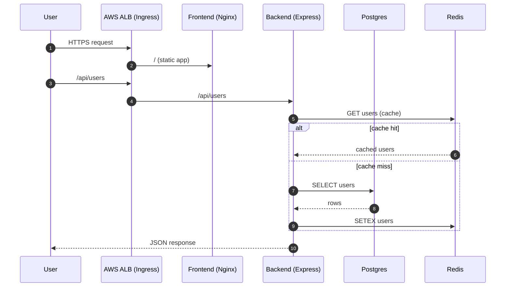
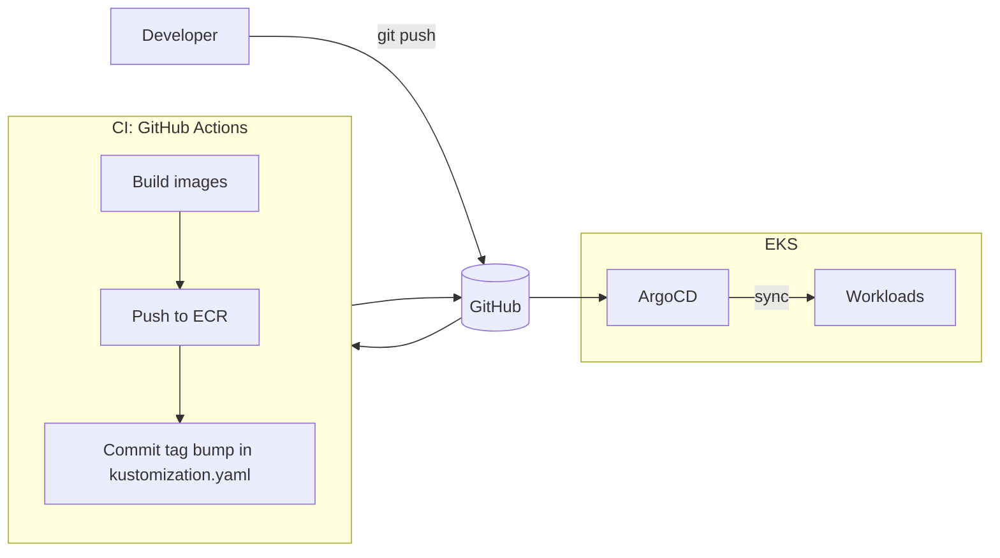

# Architecture (deep dive)

This document is meant to be **portfolio-friendly**: it explains the “why” and the technical trade-offs.

## 1) Runtime architecture (request path)

## 2) Delivery architecture (GitOps)

### Key idea

- **Git is the source of truth.**
- CI does not run `kubectl apply` to production.
- CI produces artifacts (images) and updates Git.

## 3) Progressive delivery

This repo includes an **Argo Rollouts canary** example for the backend.

- Canary splits are represented by rollout steps.
- Services:
  - `backend-service` (stable)
  - `backend-service-canary` (canary)

> Traffic shaping for ALB weighted routing is a deeper AWS feature; this repo keeps the example controller-focused.

## 4) Observability

### Metrics

Backend exposes Prometheus metrics:
- `/metrics` from `prom-client`

Prometheus Operator resources:
- example `ServiceMonitor`
- `PrometheusRule` alerts

### Dashboards

A small JSON dashboard can be imported into Grafana:
- `eks/ops/monitoring/grafana-dashboards/app-backend-overview.json`

## 5) Secrets & security model

### Secrets

- **Sealed Secrets** demonstrate encrypted secrets stored in Git.
- For real production, prefer external secret managers:
  - AWS Secrets Manager
  - External Secrets Operator

### IAM

- Prefer **IRSA** on EKS so pods/controllers can access AWS APIs without node-wide credentials.

### Kubernetes hardening

- securityContext (`runAsNonRoot`, `drop ALL`, `seccompProfile: RuntimeDefault`)
- NetworkPolicies (depends on CNI enforcement)
- PDBs + PriorityClasses

## 6) Backup/DR

- GitOps covers “desired state” restore.
- Velero covers:
  - cluster metadata restore
  - PVC snapshot restore

Runbook:
- `docs/ops/backup-dr.md`
